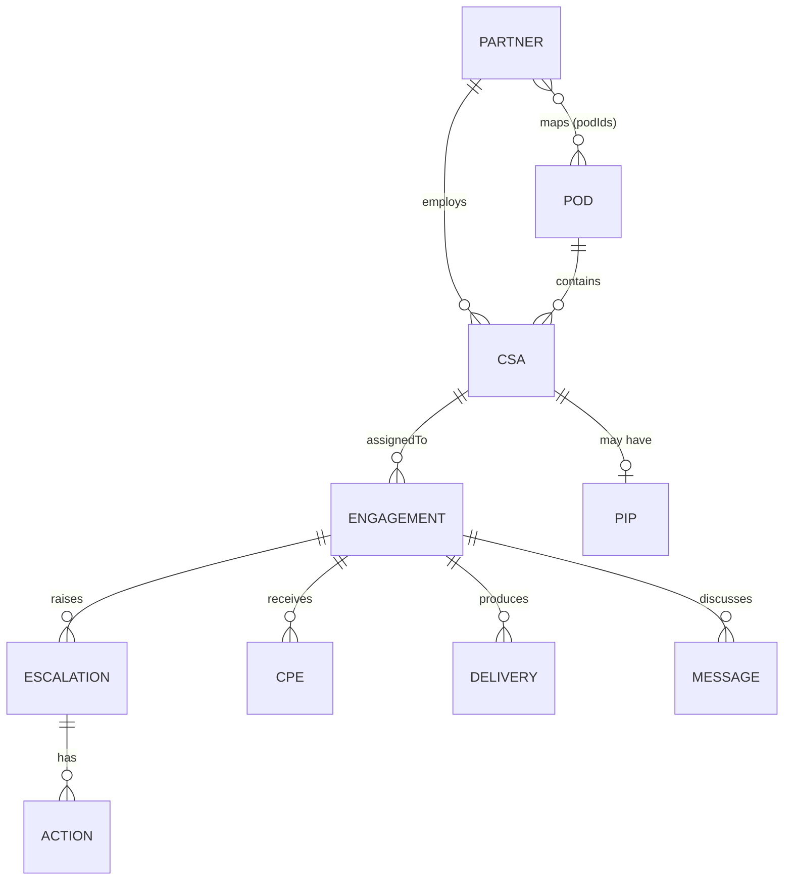

# Domain: SSD IQ — System of Records

> The governed single source of truth. Every other domain reads and writes its entities here, with
> source-of-truth badges, relationships, audit trails, natural-language search and data-quality flags.

## 1. At a glance

| Field | Value |
|---|---|
| Domain ID | `ssdiq` |
| Module route | `#/ssdiq` |
| Prototype status | Implemented |
| Primary personas | All (PIP records gated by `view:pip`) |
| Source-of-truth systems (target) | MOSA, Operations, Dispatch, Azure DevOps, Power BI, CPE/Forms, Teams, HR, AI Services |
| Upstream domains (depends on) | Identity/RBAC (01) |
| Downstream domains (consumed by) | **All** |
| Prototype source | `data/generate.js`, `scripts/store.js`, `scripts/views/ssdiq.js` |

## 2. Purpose & problem statement

- **Why this domain exists** — SSD delivery data lives across many systems (contracts, ADO, Power BI,
  Forms, Teams, HR). Compass needs **one governed model** that unifies them so every screen speaks
  the same language, with clear ownership (source of truth), lineage (audit) and quality.
- **Who cares** — Everyone: it is the substrate for every domain and every AI answer.
- **Definition of done** — A governed data layer that federates/ingests the real source systems,
  exposes a consistent entity model with relationships, records audit/lineage, enforces
  classification (confidential), and powers search + data-quality monitoring.

## 3. Personas & permissions

All roles can browse the catalog and records **except** `pips` (Performance Improvement Plans),
which require `view:pip`. In production, field-level classification may further restrict attributes.

## 4. Key concepts & glossary

| Term | Meaning |
|---|---|
| Entity | A record type (Partner, CSA, POD, Engagement, …). |
| Source of truth | The system that owns an entity/field (shown as a badge). |
| Governance envelope | `sourceOfTruth`, `updatedAt`, and an `audit` trail on every record. |
| Relationship | A typed link between records (e.g. Engagement → Assigned CSA). |
| Data-quality flag | A detected integrity issue (e.g. in-delivery with no CSA). |

## 5. Data model

The canonical entity model (prototype: seeded, deterministic in `data/generate.js`). Every record
carries the **governance envelope** (`sourceOfTruth`, `updatedAt`, `audit[]`).

| Entity | ID prefix | Key fields | Source of truth |
|---|---|---|---|
| **Partner** (Delivery Partner) | `P#` | `name`, `type`, `region`, `cpe` (derived), `deliveries`, `status` (active/onboarding), `contractRef` (MOSA), `podIds[]` | MOSA |
| **CSA** (Partner CSA) | `CSA###` | `name`, `vendor`, `partnerId`, `podId`, `tracks[]`, `skills[]`, `capacity`, `utilization`, `tenureMonths`, `lifecycle`, `cpe`, `quality`, `sentiment` | Operations |
| **POD** | `POD#` | `name`, `leadName`, `region`, `tz`, `tzLead`, `tracks[]`, `capacity`, `utilization` | SSD IQ |
| **Engagement** | `ENG###` | `customer`, `csamName`, `track`, `program`, `assignedTo`, `status`, `dispatchStage`, `outreach{day0..3}`, `milestones[]`, `dueDate`, `atRisk` | Dispatch |
| **Delivery** | `DLV###` | `engagementId`, `type`, `completedDate`, `track` | Power BI |
| **Escalation** | `ESC###` | `engagementId`, `severity` (sev1–4), `status`, `ownerName`, `sdmName`, `adoRef`, `opened`, `slaHours`, `actionIds[]`, `summary` | Azure DevOps |
| **Action Item** | `ACT###` | `escalationId`, `title`, `ownerName`, `due`, `status` | Azure DevOps |
| **CPE Feedback** | `CPE###` | `engagementId`, `score`, `track`, `verbatim`, `date`, `sentiment` | CPE/Forms |
| **Message** | `MSG###` | `threadId`, `engagementId`, `from`, `to`, `body`, `timestamp`, `sentiment` | Teams |
| **PIP** (confidential) | `PIP###` | `csaId`, `status`, `opened`, `objectives[]`, `checkIns[]`, `outcome` | Confidential/HR |
| **Sentiment Rollup** | `SEN###` | `scope`, `scopeType` (partner/track), `period`, `net`, `positive`, `neutral`, `negative`, `themes[]` | AI Services |

### Reference data

- **Tracks / Success Programs:** Scoping (P&E), Customer Health, ESA, AI Innovation, Cloud — each
  with named programs (e.g. ESA → Expert Security Assessment, Zero Trust Review).
- **Regions → Time Zones:** Americas (North America, LATAM) · EMEA (Iberia, UKI, DACH, Nordics,
  France, Italy) · ASIA (India, ANZ).
- **CSA lifecycle states:** sourcing → selection → onboarding → active → offboarding.

### Relationships (cardinality)

## 6. Features (current prototype)

1. **Entity catalog** — 11 entities as tiles with live counts and **source-of-truth badges**
   (`ssdiq.js → CFG`).
2. **Record tables** — per-entity grid (first 60 rows) with entity-specific columns and pills.
3. **Record drawer** — full field list, **relationships as clickable chips** (navigate the graph),
   and the **audit trail**; special rendering for `outreach`, `milestones`, `checkIns`.
4. **Natural-language search** — `nlSearch` across partners, CSAs, PODs, engagements and escalations;
   also reachable from the global command-bar search.
5. **Data-quality flags** — `dataQualityFlags` surfaces integrity issues with severity.
6. **Confidential gating** — `pips` entity hidden unless `view:pip`.

## 7. User stories

### Epic: Governed model
- As **any user**, I want one consistent entity model with clear ownership, so that every screen and
  AI answer agrees on the facts.
- As **a data steward**, I want each field to show its source of truth, so that I know where to fix it.

### Epic: Explore & search
- As **any user**, I want to browse any entity and open a record with its relationships, so that I can
  understand context in one place.
- As **any user**, I want natural-language search across entities, so that I can find a partner, CSA,
  engagement or escalation quickly.

### Epic: Lineage & quality
- As **a data steward**, I want an audit trail per record, so that I can see who changed what and when.
- As **an operator**, I want automated data-quality flags, so that broken links (e.g. in-delivery with
  no CSA) get fixed before they hurt delivery.

## 8. Business rules & logic

- **Governance envelope** on every record: `sourceOfTruth`, `updatedAt`, `audit[]`.
- **Derived fields:** partner `cpe` = mean of its CSAs' CPE; partner `podIds` = distinct PODs of its
  CSAs.
- **Data-quality rules** (prototype): in-delivery engagement with no assigned CSA (high); escalation
  past its SLA (high); active CSA over 95% utilization (medium); partner with no PODs mapped (low).
- **Confidential classification:** `pips` require `view:pip`; hide by default.
- **Determinism (prototype):** all data seeded (`mulberry32`, seed `20260728`) so demos are
  repeatable; "now" is pinned to `2026-07-28T09:00:00Z`.

## 9. AI capabilities

| AI feature | Input | Output | Prototype | Production seam |
|---|---|---|---|---|
| NL record search | query text | ranked entity hits | `ai.js → nlSearch` (substring match) | Vector/semantic search over SSD IQ |
| Data-quality flags | dataset | list of issues + severity | `ai.js → dataQualityFlags` (rules) | Rules + anomaly detection |

## 10. Screens & UI

- **Catalog** of entity tiles (count + source badge).
- **Entity table** with contextual columns and pills.
- **Record drawer**: fields, relationships (clickable), audit trail.
- **Global search** field (command bar) → SSD IQ NL search.
- **Data-quality flags** panel toggle.

## 11. Integrations & source systems (production)

| System | Owns | Direction | Notes |
|---|---|---|---|
| MOSA / contracting | Partner + contract refs | inbound | `contractRef`, partner status. |
| Operations systems | CSA roster, tenure, utilization, lifecycle | inbound | |
| Dispatch system | Engagements, assignment, outreach, milestones | in/out | |
| Azure DevOps | Escalations + action items (`adoRef`, `AB#`) | in/out | |
| Power BI / delivery data | Completed deliveries | inbound | |
| Forms / CPE platform | CPE scores + verbatims | inbound | |
| Microsoft Teams | Messages/threads | in/out | |
| HR systems | PIPs (confidential) | inbound | Restricted. |
| AI Services | Sentiment rollups | inbound | See [AI & Copilot](03-ai-and-copilot.md). |

## 12. KPIs & metrics

| Metric | Definition | Target |
|---|---|---|
| Data-quality flags open | Count of unresolved integrity issues | Trend to 0 |
| Freshness | Max age of `updatedAt` by entity vs source | Within SLA per source |
| Relationship integrity | % records with valid foreign keys | 100% |

## 13. Non-functional requirements

- **Security:** field/record classification; PIP restriction; encrypted at rest/in transit.
- **Privacy:** minimise PII; mask where possible; access-log confidential reads.
- **Auditability:** immutable audit/lineage per record.
- **Performance:** paginate large entities (prototype caps at 60 rows).
- **Master data:** define system of record per field; reconcile conflicts.

## 14. Prototype → production gaps

- [ ] Replace seeded generator with **real ingestion/federation** from each source system.
- [ ] Implement **master-data management** (field-level source of truth, conflict resolution).
- [ ] Real **audit/lineage** capture (not synthesised).
- [ ] **Semantic search** (embeddings) instead of substring match.
- [ ] Expand **data-quality** to a rules + anomaly engine with workflow to assign/resolve flags.
- [ ] **Pagination, filtering, sorting, export** on entity tables.
- [ ] **Field-level classification** and masking for PII/confidential attributes.

## 15. Backlog (epics → stories)

| ID | Epic | Story | Priority | Notes |
|---|---|---|---|---|
| IQ-1 | Ingestion | Connectors for MOSA, ADO, Power BI, Forms, Teams, HR | Must | Per-source SoT |
| IQ-2 | MDM | Field-level source-of-truth + reconciliation | Must | Trust |
| IQ-3 | Lineage | Real audit/lineage capture per write | Must | Compliance |
| IQ-4 | Search | Semantic NL search over entities | Should | Replaces substring |
| IQ-5 | DQ | Data-quality engine with assign/resolve workflow | Should | Ops |
| IQ-6 | UX | Table pagination/sort/filter/export | Should | Scale |
| IQ-7 | Security | Field classification + masking | Must | PII |

## 16. Open questions & assumptions

- **Q:** Federate (virtualise) or ingest (copy) the source data? **A (assumption):** hybrid —
  ingest for analytics, federate for live status.
- **Q:** Which system owns POD structure? **A (assumption):** SSD IQ itself owns PODs; others are
  ingested.

## 17. References

- Prototype source: `data/generate.js` (entity model + seed), `scripts/store.js` (selectors,
  KPIs, mutations), `scripts/views/ssdiq.js` (catalog, drawer, search, DQ).
- Related: **every** domain doc; especially [AI & Copilot](03-ai-and-copilot.md).
