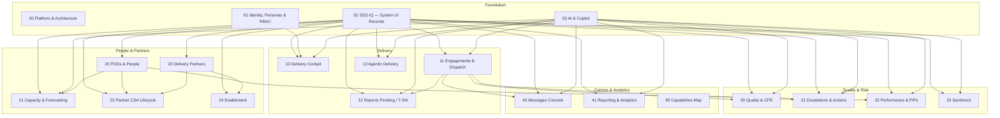

# SSD Delivery Console (Compass) — Domain Specifications

This folder documents every **domain** in the Compass prototype so the team can implement the
real product. Each domain is a self-contained specification: purpose, data model, features,
user stories, business rules, AI behaviour, integrations, KPIs, and a **backlog** section.

> **Context.** Compass is a clickable prototype (vanilla JS, seeded mock data, simulated AI) of the
> **SSD Delivery Console** over the **SSD IQ** system of records. These specs translate what the
> prototype demonstrates into build-ready requirements. Every figure and name in the prototype is
> fictional/mock; the domain rules and workflows are the real target.

## How to use these docs

1. Start with the **foundation** docs (`00`–`03`) — they define the platform, identity model,
   data foundation and AI layer that every business domain depends on.
2. Each business domain doc follows [`_TEMPLATE.md`](_TEMPLATE.md). The **User stories** (§7) and
   **Backlog** (§15) sections are written to drop straight into a work-tracking tool.
3. **Prototype → production gaps** (§14) list what is currently mocked and must be built for real.

## Domain map

## Index

### Foundation (cross-cutting)
| # | Domain | Route | Status |
|---|---|---|---|
| 00 | [Platform & Architecture](00-platform-architecture.md) | — | Implemented |
| 01 | [Identity, Personas & RBAC](01-identity-personas-rbac.md) | role switcher | Implemented |
| 02 | [SSD IQ — System of Records](02-ssd-iq-system-of-records.md) | `#/ssdiq` | Implemented |
| 03 | [AI & Copilot](03-ai-and-copilot.md) | Copilot dock | Implemented (simulated) |

### Delivery
| # | Domain | Route | Status |
|---|---|---|---|
| 10 | [Delivery Cockpit (Home)](10-delivery-cockpit.md) | `#/home` | Implemented |
| 11 | [Engagements & Dispatch](11-engagements-and-dispatch.md) | `#/engagements` | Implemented |
| 12 | [Reports Pending / T-3W](12-reports-pending.md) | `#/reports-pending` | Implemented |
| 13 | [Agentic Delivery](13-agentic-delivery.md) | `#/agentic` | Implemented (simulated) |

### People & Partners
| # | Domain | Route | Status |
|---|---|---|---|
| 20 | [PODs & People](20-pods-and-people.md) | `#/pods` | Implemented |
| 21 | [Capacity & Forecasting](21-capacity-and-forecasting.md) | `#/capacity` | Implemented |
| 22 | [Partner CSA Lifecycle](22-partner-csa-lifecycle.md) | `#/lifecycle` | Implemented |
| 23 | [Delivery Partners](23-delivery-partners.md) | `#/delivery-partners` | Implemented |
| 24 | [Enablement](24-enablement.md) | `#/enablement` | Implemented |

### Quality & Risk
| # | Domain | Route | Status |
|---|---|---|---|
| 30 | [Quality & CPE](30-quality-and-cpe.md) | `#/quality` | Implemented |
| 31 | [Escalations & Actions](31-escalations-and-actions.md) | `#/escalations` | Implemented |
| 32 | [Performance & PIPs](32-performance-and-pips.md) | `#/performance` | Implemented |
| 33 | [Sentiment](33-sentiment.md) | `#/sentiment` | Implemented |

### Comms & Analytics
| # | Domain | Route | Status |
|---|---|---|---|
| 40 | [Messages Console](40-messages-console.md) | `#/messages` | Implemented |
| 41 | [Reporting & Analytics](41-reporting-and-analytics.md) | `#/reporting` | Implemented |
| 90 | [Capabilities Map](90-capabilities-map.md) | `#/capabilities` | Implemented |

## Shared glossary

| Term | Meaning |
|---|---|
| **SSD** | Specialist Success / Solution Delivery organisation that runs the console. |
| **Compass** | The SSD Delivery Console prototype (this app). |
| **SSD IQ** | The governed **system of records** — the single source of truth for all entities. |
| **Partner CSA** | Partner Cloud Solution Architect who delivers engagements. |
| **POD** | A managed group of Partner CSAs led by a POD Lead, mapped to a region. |
| **Time Zone (TZ)** | Global rollup: **Americas**, **EMEA**, **ASIA**. Regions/OUs roll up to a TZ. |
| **OU** | Organizational Unit — the US territory grouping (inclusive alternative to region). |
| **Success Program / Track** | Delivery offering: Scoping (P&E), Customer Health, ESA, AI Innovation, Cloud. |
| **Engagement** | A unit of delivery demand dispatched to a Partner CSA. |
| **Dispatch** | Assigning demand to the best-fit CSA and starting outreach. |
| **Day 0–3 outreach** | The proactive outreach cadence a CSA must run at engagement start. |
| **T-3W** | "Three weeks out" — the proactive engagement window before a report is due. |
| **CPE** | Customer & Partner Experience score (target ≥ 4.4 / 5). |
| **Escalation** | A tracked delivery concern with a severity and SLA, co-owned with an SDM. |
| **SDM** | Service Delivery Manager — co-owns escalations and partner health. |
| **DPSM** | Delivery Partner Service Manager — sourcing, headcount, onboarding, capacity. |
| **MBR** | Monthly Business Review (partner-facing and internal variants). |
| **PIP** | Performance Improvement Plan (confidential). |
| **MOSA** | The partner contracting vehicle referenced on Delivery Partner records. |
| **S500** | Eligibility program (CPE ≥ 4.4, quality ≥ 4.4, tenure ≥ 6 months). |
| **IP** | Reusable delivery intellectual property (playbooks, templates, kits). |

## Leadership org (as modelled)

| Role | Name (mock) |
|---|---|
| Worldwide Lead | James Miller |
| Business Manager | Sandra Banuchi Vargas |
| Americas TZ Lead | Athena Sapir |
| EMEA TZ Lead | Leandro Frasso |
| ASIA TZ Lead | Michael Best |

**TZ → regions:** Americas = North America, LATAM · EMEA = Iberia, UKI, DACH, Nordics, France,
Italy · ASIA = India, ANZ.

> These names are used for realism in the prototype; treat them as configuration, not code.
