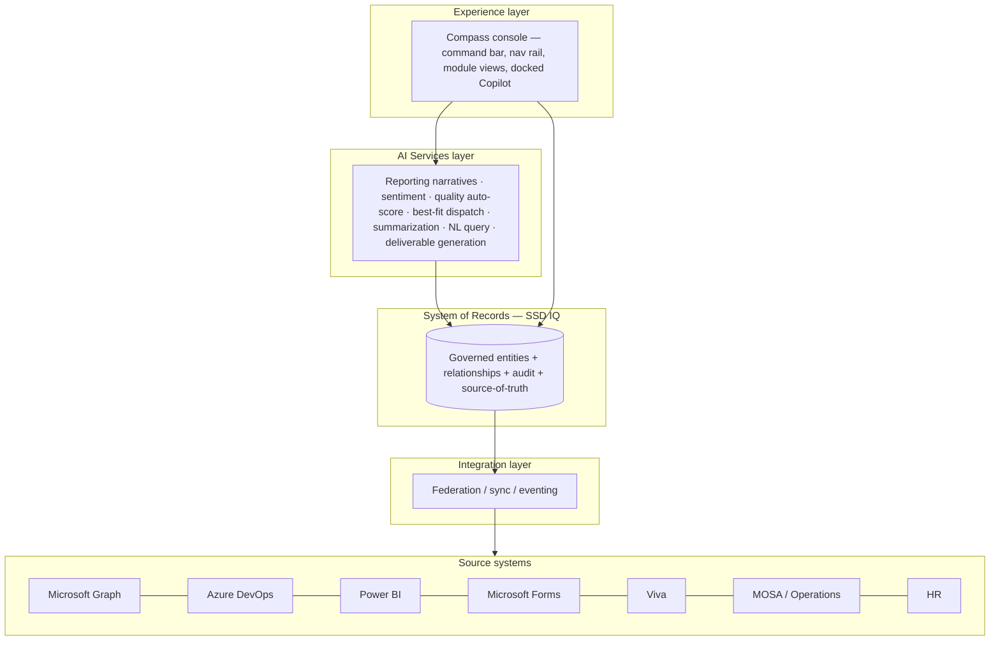

# 01 — Solution Architecture

> The layered architecture for Compass and a **recommended** concrete target stack. Capability specs
> stay technology-agnostic; this document is the one place that proposes specific technologies, clearly
> marked as recommendations open to revision.

## 1. Logical architecture

Compass is a layered system. The prototype preserves this exact shape with the lower layers mocked, so
the path to production is obvious.

**Layer responsibilities**

| Layer | Responsibility |
|---|---|
| Experience | Fluent-styled shell, module views, role-aware nav, docked contextual Copilot, deep-linking. |
| AI Services | The single seam for all AI: grounded generation, scoring, classification, retrieval, NL query. See [05](05-ai-and-copilot-platform.md). |
| SSD IQ (System of Records) | Governed canonical model; every module is a **view over SSD IQ**, not a silo. See [02](02-data-and-system-of-record.md). |
| Integration | Federate/sync/event with source systems; each field records its source of truth. See [03](03-integrations.md). |
| Source systems | Graph, Azure DevOps, Power BI, Forms, Viva, MOSA/Operations, HR. |

## 2. Recommended target stack (open to revision)

> These are **recommendations**, not mandates. They reflect the "native Microsoft 365 experience" and
> "Azure OpenAI over SSD IQ" intent in the brief.

| Concern | Recommendation | Rationale / alternatives |
|---|---|---|
| Web app | **React + Fluent UI (Fluent 2)** SPA | Matches the M365 idiom the brief specifies. Alt: Blazor + Fluent UI. |
| Charts | Fluent-compatible charting (e.g. Recharts / Chart.js / Power BI embedded) | Prototype uses Chart.js; embed Power BI where the SoT is Power BI. |
| BFF / API | **.NET (ASP.NET Core) or Node** BFF exposing a typed API | Aggregation, auth, per-field federation, AI orchestration. |
| System of Records | **Microsoft Dataverse or Microsoft Fabric** | Brief names both; Dataverse for transactional + security, Fabric for analytics. Likely **both** (Dataverse for records, Fabric for analytics/KPIs). |
| Identity | **Microsoft Entra ID** (SSO, app roles, groups) | RBAC source; replaces prototype role switcher. |
| AI | **Azure OpenAI** + retrieval over SSD IQ (RAG/tools) + **Azure AI Content Safety** | Grounded, guarded generation. |
| Integration | Graph SDK, Azure DevOps API, Power BI Embedded, Forms/Graph, Viva | Federate-not-copy. See [03](03-integrations.md). |
| Hosting | Azure (App Service / Container Apps / Static Web Apps + API) | Managed, scalable. |
| Observability | Application Insights + Azure Monitor | RUM, errors, AI telemetry. |
| Secrets/config | Azure Key Vault + App Configuration | No secrets in client; externalised config. |

## 3. Experience-layer shell

Preserve the prototype's proven shell (see `index.html`, `scripts/bootstrap.js`, `scripts/nav.js`):

- **48px command bar:** product name, global SSD IQ search, Ask Copilot, notifications, role/profile,
  theme toggle (light **and** dark — added in the prototype and retained).
- **260px collapsible nav rail:** role-permitted modules only.
- **Content area:** capped ~1440px, 12-column grid, 8px-radius cards.
- **Docked, collapsible Copilot** on every screen, contextual to the current view.
- **Hash/deep-link routing** so any record is linkable.

The reusable component library (KPI cards, data grids, kanban, timelines, scorecards, status/severity/
sentiment pills, donut/line/bar charts, tabbed panels, intake modals, drawers, toasts, Copilot panel)
is specified for reuse; the prototype implements all of it in `scripts/components.js`.

## 4. Data & AI flow

1. A module view requests data from the **BFF/API**, which reads **SSD IQ**.
2. SSD IQ federates to source systems per field's **source of truth** (read) and writes back where
   Compass is the SoT or via the owning system's API (e.g. create an ADO work item for an escalation).
3. AI requests go through the **AI Services** seam, which **grounds** on SSD IQ, applies guardrails, and
   returns **labelled, evidence-linked** output.
4. All writes are **audited**; confidential data (PIPs) is access-gated end to end.

## 5. Environments & deployment

| Environment | Purpose | Data |
|---|---|---|
| Dev | Engineering | Synthetic (the prototype's seeded generator is a good source). |
| Test/Pilot | 1–2 PODs (Phase 1) | Real, scoped; live ADO/Power BI/Graph. |
| Prod | All PODs/partners (Phase 2+) | Real, governed. |

CI/CD with infrastructure-as-code; environment-scoped config; progressive rollout by POD/TZ. See
[08 — Roadmap & Phasing](08-roadmap-and-phasing.md).

## 6. Cross-cutting architecture principles

- **Federate, don't copy.** SSD IQ records the source of truth per field; Compass reads live where
  possible and writes through owning systems.
- **One AI seam.** All AI goes through the AI Services layer; the UI never calls a model directly.
- **Human-in-the-loop.** AI is advisory; no automated adverse decisions.
- **Security by design.** Auth on every route; confidential surfaces enforced at the API, not just UI.
- **Accessibility by default.** WCAG 2.1 AA; both light and dark themes.
- **Config over code.** Leadership org, TZ/OU maps, thresholds and targets are configuration.

## 7. Prototype → production mapping

| Prototype (Phase 0) | Production |
|---|---|
| Vanilla JS ES modules, no build | React/Fluent SPA with build/bundle/code-split |
| In-memory seeded JSON (`data/generate.js`) | SSD IQ on Dataverse/Fabric with federation |
| Deterministic AI mocks (`scripts/ai.js`) | Azure OpenAI grounded on SSD IQ + guardrails |
| Role switcher (`scripts/roles.js`) | Entra ID SSO + app roles/groups |
| Static Node server (`serve.mjs`) | Azure hosting + API + CI/CD |

> The vanilla-JS choice was a **Phase-0 constraint** (the build environment blocked package installs),
> not a production recommendation — see [ADR-001](09-design-decisions-and-learnings.md).

## 8. References

- Prototype: `index.html`, `scripts/bootstrap.js`, `scripts/router.js`, `scripts/nav.js`,
  `scripts/components.js`, `serve.mjs`.
- Related: [02 Data](02-data-and-system-of-record.md), [03 Integrations](03-integrations.md),
  [05 AI](05-ai-and-copilot-platform.md), [06 NFRs](06-non-functional-requirements.md).
