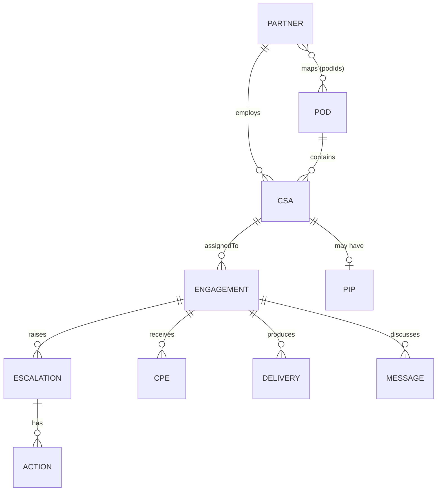

# 02 — Data & System of Record (SSD IQ)

> SSD IQ is the governed single source of truth. Every Compass module is a **view over SSD IQ**, not a
> silo. This document defines the canonical entity model, source-of-truth ownership, relationships,
> master-data/federation approach, lineage/audit, and data quality.

## 1. Principles

- **One governed model.** All entities live in SSD IQ with a consistent schema, relationships and IDs.
- **Federate, don't copy.** Each **field** records its **source of truth (SoT)**; Compass reads live
  where possible and writes through the owning system.
- **Lineage + audit on every record.** `sourceOfTruth`, `updatedAt`, and an immutable `audit[]`.
- **Classification-aware.** Confidential entities (PIPs) and PII are gated (see [04](04-security-privacy-compliance.md)).
- **Implementation:** production on **Dataverse and/or Microsoft Fabric**; the prototype is an
  in-memory seeded generator (`data/generate.js`) that is a faithful schema reference.

## 2. Canonical entities

Every record carries the **governance envelope**: `sourceOfTruth`, `updatedAt`, `audit[]`.

| Entity | ID | Key fields | Source of truth |
|---|---|---|---|
| **Partner** (Delivery Partner) | `P#` | `name`, `type`, `region`, `cpe` (derived), `deliveries`, `status` (active/onboarding), `contractRef` (MOSA), `podIds[]` | MOSA / Operations |
| **CSA** (Partner CSA) | `CSA###` | `name`, `vendor`, `partnerId`, `podId`, `tracks[]` (Families), `accreditations[]` (Programs), `languages[]`, `skills[]`, `capacity`, `utilization`, `tenureMonths`, `lifecycle`, `cpe`, `quality`, `sentiment` | Operations / Graph |
| **POD** | `POD#` | `name`, `leadName` (POD Lead), `csaManager`, `region`, `tz`, `tzLead`, `tracks[]` (Families), `capacity`, `utilization`, `hcActive`, `hcTarget` | SSD IQ |
| **Engagement** | `ENG###` | `customer`, `csamName`, `track`, `program`, `assignedTo`, `status`, `dispatchStage`, `outreach{day0..3}`, `milestones[]`, `dueDate`, `atRisk` | Dispatch / Graph |
| **Delivery** | `DLV###` | `engagementId`, `type`, `completedDate`, `track` | Dispatch / Power BI |
| **Escalation** | `ESC###` | `engagementId`, `severity` (sev1–4), `status`, `ownerName`, `sdmName`, `adoRef`, `opened`, `slaHours`, `actionIds[]`, `summary` | Azure DevOps |
| **Action Item** | `ACT###` | `escalationId`, `title`, `ownerName`, `due`, `status` | Azure DevOps |
| **CPE Feedback** | `CPE###` | `engagementId`, `score`, `track`, `verbatim`, `date`, `sentiment` | CPE / Forms |
| **Message** | `MSG###` | `threadId`, `engagementId`, `from`, `to`, `body`, `timestamp`, `sentiment` | Graph / Teams |
| **PIP** (confidential) | `PIP###` | `csaId`, `status`, `opened`, `objectives[]`, `checkIns[]`, `outcome` | Confidential / HR |
| **Sentiment Rollup** | `SEN###` | `scope`, `scopeType` (partner/track), `period`, `net`, `positive`, `neutral`, `negative`, `themes[]` | AI Services |
| **Requisition** (hiring) | `REQ###` | `family`, `partnerId`, `podId`, `region`, `tz`, `type` (Growth/Backfill), `stage` (Sourcing→Screening→Interview→Offer→Hired), `opened`, `targetStart`, `hiredDate`, `source` | HC Consolidation (Power BI) |

### Reference / master data
- **Families (Tracks) & Programs (service catalogue):** a **Track = Family**; a **Program = service /
  event**; each Program maps 1:1 to an **accreditation**. Families → Programs:
  - **Health:** ESA, Azure, M365, D365, Crisis Management — DMIRP, Crisis Management — Azure Sim,
    Crisis Management — M365 Sim, Crisis Management — Security, Crisis Management — D365 Sim.
  - **AI Innovation:** Adoption, Secure Copilot, Agents.
  - **Cloud Deployment:** MACC, AIR, Cloud Modernization, GitHub Copilot.
  - **Foundations:** UfP, UO — Onboarding, OU — DMIRP, OU — Capability Briefing AI Innovation, OU —
    Capability Briefing Resiliency and Security, OU — Capability Briefing Cloud Success.
- **Delivery languages by time zone:** Americas — English, Spanish, Portuguese, French · EMEA — English,
  Spanish, Portuguese, French, Arabic, German · ASIA — English, Japanese, Mandarin, Korean. A CSA can
  deliver in **any territory**; language (not location) is the coverage constraint.
- **Org hierarchy:** WW Lead → TZ Lead → CSA Manager → POD Lead (multiple POD Leads per Territory/OU);
  each POD has multiple Partner CSAs.
- **Regions → Time Zones:** Americas (North America, LATAM) · EMEA (Iberia, UKI, DACH, Nordics, France,
  Italy) · ASIA (India, ANZ). **US territories additionally roll up to OUs** (see [CAP-17](capabilities/CAP-17-reporting-and-mbr.md)).
- **CSA lifecycle states:** sourcing → selection → onboarding → active → offboarding.
- **Severity → SLA:** sev1 = 8h, sev2 = 24h, sev3 = 48h, sev4 = 72h.
- **Leadership org / TZ leads:** configuration (fictional vanity names in the prototype), not code.

## 3. Relationships

- Partner **CPE** is derived (mean of its CSAs' CPE); partner **podIds** derived (distinct PODs of its
  CSAs). Derivations must be recomputed on write in production.

## 4. Master data & federation

| Concern | Approach |
|---|---|
| Source of truth | Per-field SoT recorded on every record (see table §2). |
| Read | Prefer live federation to the SoT; cache/materialise for analytics (Fabric). |
| Write | Write through the owning system's API (e.g. create ADO work item for an escalation) and reflect back into SSD IQ. |
| Conflict resolution | SoT wins; non-SoT copies are read models. Reconciliation jobs detect drift. |
| Identity/keys | Stable Compass IDs mapped to source keys (e.g. `adoRef` `AB#…`, `contractRef` MOSA). |

## 5. Lineage & audit

- Every record: `sourceOfTruth`, `updatedAt`, and immutable `audit[] = {at, who, action}`.
- All writes (assignment, status change, escalation, message send, PIP change) are audited with actor
  and timestamp. Confidential reads (PIPs) are access-logged (see [04](04-security-privacy-compliance.md)).

## 6. Data quality

Automated data-quality rules (prototype: `scripts/ai.js → dataQualityFlags`), surfaced in
[CAP-03 SSD IQ Explorer](capabilities/CAP-03-ssd-iq-explorer.md):

| Rule | Severity |
|---|---|
| Engagement in-delivery with no assigned CSA | High |
| Escalation past its SLA | High |
| Active CSA utilization > 95% | Medium |
| Partner with no PODs mapped | Low |

Production extends this to a rules + anomaly engine with assign/resolve workflow, freshness and
foreign-key integrity monitoring.

## 7. Search

- **Natural-language record search** across entities (prototype: substring `nlSearch`; production:
  semantic/vector search over SSD IQ), reachable from the global command-bar search and
  [CAP-03](capabilities/CAP-03-ssd-iq-explorer.md).

## 8. Prototype → production gaps

- [ ] Implement SSD IQ on **Dataverse/Fabric**; replace the seeded generator.
- [ ] Real **federation/ingestion** per source system; per-field SoT enforcement.
- [ ] Real **audit/lineage** capture; confidential access logging.
- [ ] **Semantic search**; pagination/sort/filter/export on entity views.
- [ ] **Data-quality engine** with workflow; freshness + integrity monitoring.
- [ ] **Field-level classification** + masking for PII/confidential.

## 9. References

- Prototype: `data/generate.js` (schema + seed), `scripts/store.js` (selectors/derivations/mutations),
  `scripts/views/ssdiq.js` (catalog/drawer/search/DQ).
- Related: [03 Integrations](03-integrations.md), [04 Security](04-security-privacy-compliance.md),
  [CAP-03 SSD IQ Explorer](capabilities/CAP-03-ssd-iq-explorer.md).
